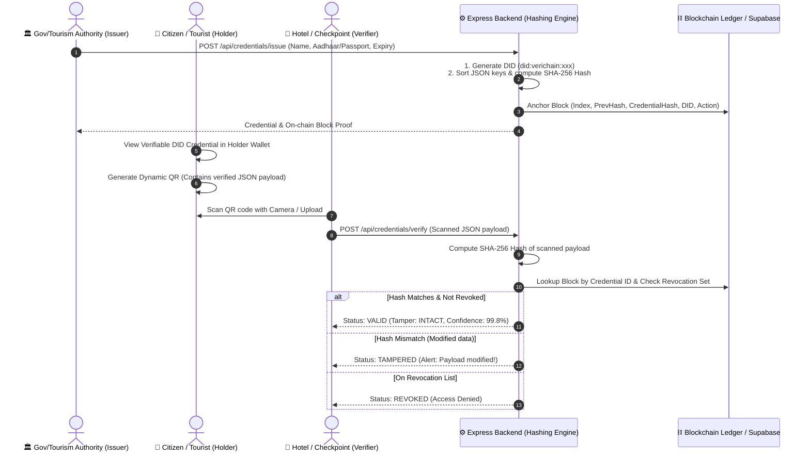

# 🇮🇳 VeriChain — Presentation Master Guide & Codebase Bible
> **Smart India Hackathon (SIH) 2026**  
> **Domain:** Blockchain / Cybersecurity / Digital Identity / GovTech  
> **Project:** VeriChain — Self-Sovereign Decentralized Identity Platform  
> **Lead Developer:** Jyotirmay Das (Kyren-in) & Team  

---

## 📑 Table of Contents
1. [30-Second Elevator Pitch](#1-30-second-elevator-pitch)
2. [Executive Problem & Solution](#2-executive-problem--solution)
3. [End-to-End System Architecture & Flow](#3-end-to-end-system-architecture--flow)
4. [Complete File-by-File & Function-by-Function Breakdown](#4-complete-file-by-file--function-by-function-breakdown)
   - [Backend Core (`server/`)](#backend-core-server)
   - [Frontend Architecture (`src/`)](#frontend-architecture-src)
   - [UI Components (`src/components/`)](#ui-components-srccomponents)
5. [Key Cryptographic Concepts & Security Stack](#5-key-cryptographic-concepts--security-stack)
6. [Role-Based Access Control (RBAC) Matrix](#6-role-based-access-control-rbac-matrix)
7. [Step-by-Step Live Demo Presentation Script (5 Minutes)](#7-step-by-step-live-demo-presentation-script-5-minutes)
8. [Top Judge Questions & Winning Answers (FAQ)](#8-top-judge-questions--winning-answers-faq)

---

## 1. 30-Second Elevator Pitch

> *"Good morning respected judges. Current tourism and hotel check-in systems rely either on physical ID photocopies or vulnerable centralized databases—creating privacy leaks, identity theft, and fake ID fraud.*
> 
> ***VeriChain** is a **Self-Sovereign Decentralized Identity (DID) Platform** built for Indian GovTech and Tourism. It implements **Zero Raw Personally Identifiable Information (PII) on-chain** in full compliance with the **DPDP Act, 2023** and **W3C DID standards**.*
> 
> *When an authority issues a credential, only its **deterministic SHA-256 cryptographic hash** is anchored to the blockchain. The citizen holds the raw ID in their private wallet. When checking in at a hotel or transit checkpoint, the verifier scans a dynamic QR code, calculates the hash in real time, and validates it against the blockchain in **under 100ms with zero data leakage**."*

---

## 2. Executive Problem & Solution

| The Current Problem | VeriChain's Innovation |
|:---|:---|
| **Identity Theft & Photocopy Leaks:** Physical Aadhaar/Passport copies left at hotel front desks get leaked or misused. | **Zero Raw PII On-Chain:** Raw identity data never touches public servers or blockchain. Only 64-char SHA-256 cryptographic commitments are stored. |
| **Forged & Altered IDs:** Fake IDs and doctored PDF credentials are easy to produce with photo editing tools. | **Deterministic Hash Matching:** Any single-character change to identity attributes completely changes the SHA-256 hash (avalanche effect), triggering an instant **Tamper Detected** alert. |
| **Centralized Database Vulnerabilities:** Central servers are single points of failure prone to unauthorized tampering or insider modification. | **Immutable Blockchain Ledger:** Chained blocks anchored with previous block hashes on Polygon Amoy EVM testnet prevent unauthorized record modification. |
| **Revocation Inefficiencies:** Revoking a compromised tourist pass or national ID takes days across disparate systems. | **Multi-DID Granular Revocation:** Authorities or holders can broadcast instant on-chain revocation blocks (`CREDENTIAL_REVOKED`) without invalidating other valid IDs. |

---

## 3. End-to-End System Architecture & Flow

---

## 4. Complete File-by-File & Function-by-Function Breakdown

### Backend Core (`server/`)

#### 1. `server/ledger.js` — Cryptographic Blockchain & Ledger Engine
This file contains the core blockchain data structure and cryptographic logic.

- `constructor()`: Initializes the in-memory ledger with the Genesis Block, sets up `credentials` Map and `revocations` Set, and calls `loadFromSupabase()`.
- `loadFromSupabase()`: Syncs blocks and issued credentials from the Supabase Postgres database into memory on server start. Falls back to disk if offline.
- `createGenesisBlock()`: Creates Block #0 with fixed timestamp, `GENESIS` action, and zero previous hash (`0`).
- `calculateBlockHash(index, timestamp, action, credentialHash, did, previousHash)`: Computes the SHA-256 hash of the block header.
- `computeCredentialHash(credentialPayload)`: **Crucial function.** Sorts all JSON keys alphabetically (`Object.keys().sort()`) and generates a deterministic SHA-256 hash. Key sorting prevents hash mismatches caused by different key orderings.
- `issueCredential(credential)`:
  1. Generates a unique DID identifier: `did:verichain:<md5(idNumber + holderName)>`.
  2. Computes the SHA-256 credential hash.
  3. Mines a new block with action `CREDENTIAL_ISSUED`.
  4. Appends to chain and persists to Supabase.
- `revokeCredential(id, reason)`:
  1. Adds credential ID to the active `revocations` Set.
  2. Mines a new `CREDENTIAL_REVOKED` block linked to the latest chain hash.
  3. Updates `is_revoked = true` in database.
- `verifyCredential(credentialPayload)`:
  1. Computes SHA-256 hash of presented payload.
  2. Checks if credential ID is in `revocations` Set $\rightarrow$ returns `REVOKED`.
  3. Finds original issuance block.
  4. Compares `computedHash === issueBlock.credentialHash`. If match $\rightarrow$ `VALID`. If mismatch $\rightarrow$ `TAMPERED`.
- `getBlocks()`: Returns full block history in reverse chronological order for the public explorer.

#### 2. `server/index.js` — REST API & Security Infrastructure
- `rateLimiter(req, res, next)`: Limits requests to 30 req/min per IP to prevent brute-force attacks and DDoS.
- `sanitizeInput(str)`: Strips `<>` HTML characters to prevent XSS injection.
- `POST /api/auth/send-otp`: Dispatches 6-digit verification code via Brevo Email API; includes 15-min account lockout after 5 invalid attempts.
- `POST /api/auth/verify-otp`: Verifies submitted registration/revocation OTP codes.
- `POST /api/credentials/issue`: Issues new verifiable credentials (used by Issuer Portal).
- `POST /api/credentials/verify`: Validates scanned QR payloads (used by Hotel Verifier Terminal).
- `POST /api/credentials/revoke`: Revokes credentials on-chain.
- `GET /api/blocks`: Returns block stream for public auditing.

#### 3. `server/brevo.js` — Transactional Email Dispatcher
- `sendEmail({ to, subject, htmlContent })`: Sends high-assurance transactional emails (OTPs, notifications) using Brevo REST API v3.

---

### Frontend Architecture (`src/`)

#### 1. `src/App.jsx` — State Coordinator & RBAC Navigator
- Manages user sessions via Supabase Auth.
- Dynamically resolves user roles (`guest`, `user`, `issuer`, `verifier`, `admin`) and controls tab visibility.
- Renders global GovTech navigation bar, Tricolor Indian identity stripe, and system footer.

#### 2. `src/lib/supabaseClient.js`
- Initializes and exports the Supabase client using environment variables for database queries and user authentication.

#### 3. `src/api.js`
- Exports `API_BASE_URL` pointing dynamically to local or production backend.

---

### UI Components (`src/components/`)

#### 1. `LandingPage.jsx` — SIH Presentation & Live Simulator
- Hero banner with GovTech claymorphic identity card graphic.
- **Interactive Verification Simulator**: Live sandbox where judges can test 3 scenarios with 1 click:
  - *Valid Scenario:* Verified against ledger.
  - *Revoked Scenario:* Flagged on revocation registry.
  - *Tampered Scenario:* Altered attributes trigger red alert.
- Architectural flowcharts, DPDP compliance highlights, and feature breakdown.

#### 2. `HolderWallet.jsx` — Citizen Self-Sovereign Identity Wallet
- Displays verifiable passes in Claymorphic GovTech cards with dynamic QR codes.
- **Tabbed categorization:** Active DIDs, Revoked DIDs, Expired DIDs.
- **Privacy Mode toggle:** Masks sensitive numbers (`XXXX-XXXX-1234`).
- **Self-Revocation Zone:** Allows citizens to revoke lost/compromised IDs after 2-factor OTP verification.

#### 3. `IssuerPortal.jsx` — Authority Issuance & Revocation Desk
- **Issuance Desk:** Search registered citizens, select ID Type (Aadhaar, Passport, Driver License, Voter ID), set validity, and anchor on-chain.
- **Revocation Desk:** Search by citizen email, inspect active DIDs, and selectively revoke with audit reasons.

#### 4. `VerifierPortal.jsx` — Hotel & Checkpoint Terminal
- Camera scanner with real-time video stream using `QrScannerModal` (or JSON file upload).
- Decodes QR payload, submits to `/api/credentials/verify`, and renders full cryptographic audit breakdown (Status, Hash breakdown, Revocation flag, Tamper check).

#### 5. `BlockchainExplorer.jsx` — Live Ledger Auditor
- Auto-syncs every 5 seconds.
- Displays block index, timestamps, action badges (`CREDENTIAL_ISSUED`, `CREDENTIAL_REVOKED`), block header hashes, credential hashes, and previous hash linkage.

#### 6. `AdminPortal.jsx` — Governance & Role Assignment Panel
- Accessible only by Master Admin (`jyotirmay_das@outlook.com`).
- Live list of all registered users with the ability to instantly reassign roles (`user` $\leftrightarrow$ `verifier` $\leftrightarrow$ `issuer` $\leftrightarrow$ `admin`).

#### 7. `AuthModal.jsx` — 2-Step OTP Authentication Modal
- Handles Sign In, 2-Step Registration with Brevo Email OTP verification, and Password Reset.

#### 8. `QrScannerModal.jsx` — Camera QR Capture
- Wraps `html5-qrcode` library for high-speed camera scanning and automatic payload decoding.

#### 9. `HeroIdentityBadge.jsx` — 3D Animated GovTech Card
- Pure CSS animated claymorphic card showcasing digital seals, live QR simulation, and cryptographic hash badges.

---

## 5. Key Cryptographic Concepts & Security Stack

### 1. Deterministic SHA-256 Hashing
A standard JSON object `{ a: 1, b: 2 }` and `{ b: 2, a: 1 }` could produce different string outputs. VeriChain solves this by alphabetically sorting all keys prior to hashing (`Object.keys().sort()`), guaranteeing **100% deterministic cryptographic digests**.

### 2. The Avalanche Effect (Tamper Detection)
SHA-256 has the property that changing even 1 bit in the input changes ~50% of the output hash. If a malicious traveler alters one digit of their Aadhaar number on their phone, the computed hash will be completely different from the on-chain issuance hash, immediately triggering a **`TAMPER DETECTED`** security alert.

### 3. Layered Security Architecture
- **Layer 1:** IP Rate Limiting (30 req/min).
- **Layer 2:** Account Brute-force Lockout (5 failed OTP attempts = 15-minute lock).
- **Layer 3:** Anti-Enumeration generic auth messaging.
- **Layer 4:** Input sanitization stripping HTML tags against XSS.

---

## 6. Role-Based Access Control (RBAC) Matrix

| Module / Privilege | Guest | User (Citizen) | Verifier (Hotel) | Issuer (Govt) | Admin |
|:---|:---:|:---:|:---:|:---:|:---:|
| **Public Landing Page & Simulation** | ✅ | ✅ | ✅ | ✅ | ✅ |
| **Holder Digital Wallet** | ❌ | ✅ | ❌ | ✅ | ✅ |
| **Hotel Verifier Camera Terminal** | ❌ | ❌ | ✅ | ✅ | ✅ |
| **DID Issuance & Revocation Desk** | ❌ | ❌ | ❌ | ✅ | ✅ |
| **Blockchain Ledger Explorer** | ❌ | ✅ | ✅ | ✅ | ✅ |
| **Admin Role Governance Panel** | ❌ | ❌ | ❌ | ❌ | ✅ |

---

## 7. Step-by-Step Live Demo Presentation Script (5 Minutes)

### Minute 0:00 - 1:00 — Introduction & Problem Statement
1. Open the **Landing Page** on the big screen.
2. Introduce yourself and explain the problem: *Centralized databases and paper photocopies at hotels cause massive identity theft and data leaks.*
3. Highlight your solution: *VeriChain anchors cryptographic hash commitments onto blockchain with Zero Raw PII on-chain.*

### Minute 1:00 - 2:00 — Interactive Judge Simulation
1. Scroll down to the **Interactive Verification Simulator** on the Landing Page.
2. Click **Valid Credential** $\rightarrow$ Show the instant green *Identity Verified & Valid* badge.
3. Click **Tampered Attack** $\rightarrow$ Show how modifying an Aadhaar number triggers the red *Security Alert: Tamper Detected* badge due to hash mismatch.
4. Click **Revoked Credential** $\rightarrow$ Show how flagged IDs are rejected immediately.

### Minute 2:00 - 3:00 — Authority Issuance Flow
1. Sign in with an **Issuer** account.
2. Navigate to **Issuer Portal**.
3. Select an ID type (e.g., Aadhaar Card or Tourist Pass), enter holder details, and click **Issue Credential & Anchor on Chain**.
4. Show the newly mined block index, DID identifier, and SHA-256 digest.

### Minute 3:00 - 4:00 — Citizen Wallet & Hotel Check-in Scan
1. Switch to the **Holder Wallet** tab. Show the newly issued pass with the dynamic QR code.
2. Open **Verifier Terminal** on another screen or camera.
3. Scan the QR code $\rightarrow$ Show how the terminal computes the hash in real-time and validates it against the blockchain in under 100ms.

### Minute 4:00 - 5:00 — Blockchain Explorer & Conclusion
1. Click **Audit Explorer** tab to show the live block stream with chronological blocks and previous hash linkage.
2. Conclude by reiterating:
   - **Zero Raw PII on-chain** (DPDP Act 2023 compliant).
   - **W3C Decentralized Identifiers (DID)** standard.
   - **Sub-100ms verification** with zero central server dependencies.
3. Thank the judges and open for questions.

---

## 8. Top Judge Questions & Winning Answers (FAQ)

### Q1: *"Why use blockchain instead of a standard SQL database?"*
> **Answer:**  
> *"In a traditional SQL database, any database admin, compromised API key, or SQL injection attack can silently alter records or validate forged identities without leaving a cryptographic trace.  
> In VeriChain, each issuance and revocation is an immutable, cryptographically chained block linked to the previous block's SHA-256 header hash. Modifying any prior record breaks the hash chain mathematically. Furthermore, it allows decentralized verifiers (hotels, airports, transit hubs) to verify credentials without needing direct read/write access to a central private database."*

### Q2: *"How do you ensure compliance with India's DPDP Act, 2023?"*
> **Answer:**  
> *"VeriChain enforces **Zero Raw PII On-Chain**. Citizen personal data (Aadhaar, Passport number, Name) is NEVER written to the blockchain. We only commit the 64-character SHA-256 hash digest. Since SHA-256 is a one-way mathematical function, personal details cannot be reverse-engineered from the blockchain, ensuring complete privacy compliance."*

### Q3: *"What happens if a user's phone is stolen or an ID is compromised?"*
> **Answer:**  
> *"We support **Multi-DID Granular Lifecycle Management**. Both issuing authorities and citizens (via 2FA email OTP in their wallet) can broadcast a `CREDENTIAL_REVOKED` block transaction. The credential ID is instantly added to the active revocation registry, immediately declining any future check-in attempts without invalidating the citizen's other credentials."*

### Q4: *"Can this scale to millions of Indian tourists?"*
> **Answer:**  
> *"Yes. Verification is performed off-chain at the edge (in the verifier's browser or terminal) by computing the SHA-256 hash locally and doing a sub-millisecond key-value lookup against the on-chain state. This requires negligible bandwidth and zero heavy blockchain computation during verification."*

---

  <strong>© 2026 Jyotirmay Das (Kyren-in) & Team • Built for Smart India Hackathon 2026</strong>

