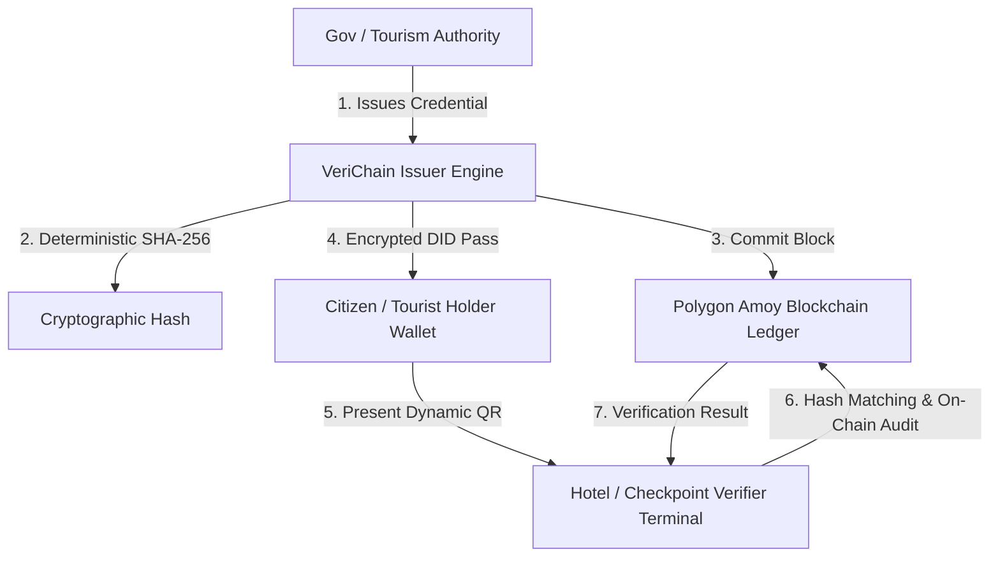

# VeriChain: Self-Sovereign Decentralized Identity Platform


---

## 🔒 Intellectual Property & Proprietary Rights Notice

> ### ⚠️ STRICT PROPRIETARY NOTICE & ALL RIGHTS RESERVED
> **This project and codebase were created and engineered specifically for Smart India Hackathon (SIH) 2026 by Jyotirmay Das (Kyren-in) and Team.**
> 
> **NO PERMISSION IS GRANTED** to any individual, organization, or third party to copy, reproduce, fork, redistribute, reverse-engineer, deploy, sub-license, or present this software or any part of its architecture, cryptographic ledger design, UI design system, or smart contract schemas without explicit, prior written consent from the primary author.
> 
> *Unauthorized commercial use, competition submission, or public re-hosting will constitute an infringement of copyright and intellectual property rights.*

---

## 🇮🇳 Executive Summary

**VeriChain** is a state-of-the-art **Decentralized Verifiable Credential & Digital Identity Platform** tailored for Indian GovTech, Tourism, and Cybersecurity infrastructure.

It bridges the security gap between legacy physical IDs and cloud databases by anchoring **cryptographic hash commitments** onto an EVM-compatible blockchain ledger (**Polygon Amoy Testnet**). VeriChain ensures that **Zero Raw Personally Identifiable Information (PII)** is ever stored on-chain, achieving total compliance with **W3C Decentralized Identifiers (DIDs)** and the **Digital Personal Data Protection (DPDP) Act, 2023**.

---

## 🏗️ Technical Architecture & Key Innovations



### 1. **Zero Raw PII Cryptographic Commitments**
- Raw citizen data (Aadhaar, Passport, PAN) remains exclusively with the credential holder.
- Only the deterministic SHA-256 hash digest is committed to the blockchain, making identity forgery mathematically impossible while guaranteeing total privacy.

### 2. **Multi-DID Granular Lifecycle Management**
- Citizens can hold multiple verifiable identities (e.g., National ID, Tourist Pass, Driver Permit).
- Authorities have granular, selective on-chain revocation control (`CREDENTIAL_REVOKED` block transaction) without affecting other valid credentials.
- Real-time categorization: **Active DIDs**, **Revoked DIDs (Authority enforced)**, and **Expired DIDs (Temporal limit passed)**.

### 3. **High-Assurance Hardened Security Stack**
- **Layer-1 Rate Limiting**: Per-IP throttling (30 req/min) prevents automated credential stuffing.
- **Layer-2 Account Lockouts**: 5 consecutive invalid OTP attempts trigger a 15-minute temporary lockout.
- **Anti-Enumeration Safeguards**: Generic error messaging prevents account/email discovery attacks.
- **HTML/XSS Sanitization**: Automated stripping of malicious payloads on all server endpoints.

---

## 🛠️ Complete Technology Stack

| Layer | Technology | Purpose |
|:---|:---|:---|
| **Frontend Framework** | **React 19 + Vite 8** | High-performance, reactive user interface |
| **Design System** | **Neumorphic + Claymorphic GovTech Tokens** | Enterprise Indian GovTech design language with soft shadows & saffron/navy/green accents |
| **Icons & Typography** | **Lucide Icons + Plus Jakarta Sans + JetBrains Mono** | Clean, accessible data presentation |
| **Blockchain / Web3** | **Ethers.js v6 + Polygon Amoy EVM Testnet** | Immutable cryptographic hash anchoring |
| **Backend Engine** | **Node.js + Express 5 (ES Modules)** | Secure REST API, cryptographic hashing, and state coordination |
| **Database & Identity** | **Supabase (PostgreSQL + Row-Level Security + Supabase Auth)** | Managed user roles, profile state, and ledger backups |
| **Email Dispatch** | **Brevo Transactional API (v3 SMTP)** | Secure OTP email verification & authorization dispatch |
| **QR Engine & Scanner**| **QRCode.js + HTML5-QRCode Scanner** | Real-time camera & canvas cryptographic verification |

---

## 👥 Role-Based Access Matrix

| Role | Accessible Modules & Privileges |
|:---|:---|
| **Guest (Unauthenticated)** | Public Competition Landing Page, Technical Overview, Secure Sign In |
| **User / Citizen (`user`)** | **Holder Digital Identity Wallet** (Active, Revoked, Expired DIDs, Dynamic QR, Self-Revocation Zone) + **Audit Explorer** |
| **Verifier (`verifier`)** | **Verifier Terminal** (Live Camera & File Scanner, On-Chain Proof Validator) + **Audit Explorer** |
| **Authority Issuer (`issuer`)** | **Issuer Portal** (Verifiable DID Issuance, Email Lookup, Multi-DID Granular Revocation) + **Verifier Terminal** + **Holder Wallet** + **Audit Explorer** |
| **Administrator (`admin`)** | **Admin Governance Panel** (Global Role Assignment, System Health, User Auditing) + **All Platform Modules** |

---

## ⚙️ Environment Variables Specification

To run this application locally, create a `.env` file in the root directory:

```env
# Server Port
PORT=5000

# Supabase Configuration
VITE_SUPABASE_URL=your_supabase_project_url
VITE_SUPABASE_ANON_KEY=your_supabase_anon_key

# Brevo Transactional Email Service
BREVO_API_KEY=your_brevo_api_key
BREVO_SENDER_EMAIL=your_verified_sender_email

# Blockchain RPC Configuration
POLYGON_AMOY_RPC=https://rpc-amoy.polygon.technology/
```

---

## 🚀 Installation & Local Development

```bash
# 1. Clone repository
git clone https://github.com/Kyren-in/VeriChain.git
cd VeriChain

# 2. Install dependencies
npm install

# 3. Build frontend bundle
npm run build

# 4. Launch full-stack production server
npm start
```

Server will start on `http://localhost:5000` with the embedded React UI and Express API.

---

## 🏆 Smart India Hackathon 2026

- **Lead Developer & Architecture**: **Jyotirmay Das (Kyren-in)**
- **Domain**: Blockchain / Cybersecurity / Digital Identity / GovTech
- **Target Problem Statement**: Trustworthy, zero-knowledge tourist & citizen identity verification at hotels and transit checkpoints.

---

<div align="center">
  <strong>© 2026 Jyotirmay Das (Kyren-in). All Rights Reserved. Built for Smart India Hackathon 2026.</strong>
</div>
